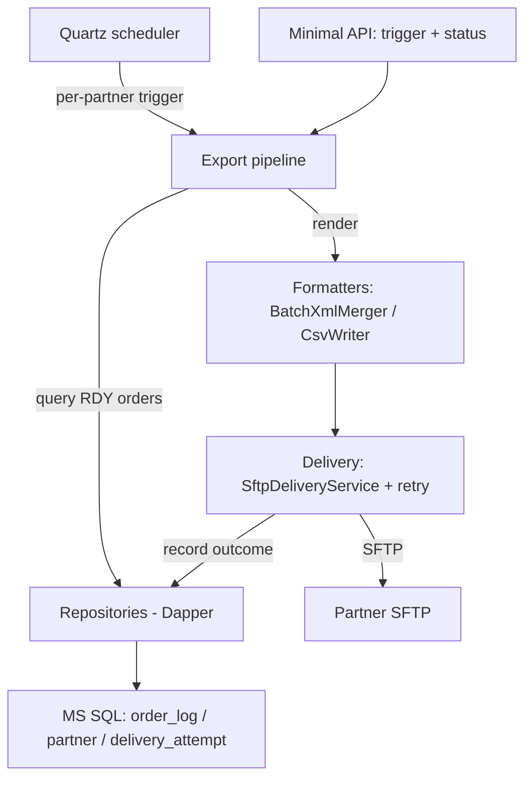

# ARCHITECTURE.md — Order Export platform

> The 10,000-foot structure: components, boundaries, and the main data flow. Part of `examples/order-export/` (illustrative).

## Components

## Components, one line each

- **Minimal API** — manual trigger + batch-status endpoints. No business logic; it calls handlers.
- **Quartz scheduler** — fires one job per partner on its schedule; the normal entry point.
- **Export pipeline** — the core: load `RDY` orders for a partner, render to the partner's format, hand off to delivery. Handlers here are **pure** (no I/O).
- **Formatters** — `BatchXmlMerger` (XML) and `CsvWriter` (CSV), selected by partner config. Pure functions of `(orders, partner) → file bytes`.
- **Delivery** — `SftpDeliveryService` uploads the file, wraps the transfer in a retry policy, and records each attempt.
- **Repositories** — Dapper, one per aggregate (`OrderLogRepository`, `PartnerRepository`, `DeliveryAttemptRepository`). All SQL lives here.
- **Database** — MS SQL Server: `app.order_log`, `app.partner`, `app.delivery_attempt`.

## Boundaries

- I/O lives in **repositories** and **delivery** — never in handlers. Handlers transform data only.
- Formatters are pure: no DB, no network.
- Cross-cutting: logging is Serilog with the `IBaseHandler<TSelf>` correlation contract; every DB method logs the operation plus the order or batch id. Input validation is FluentValidation at the API edge.

## Data flow — a normal batch

1. Quartz fires `acme-bank`'s job → handler asks `OrderLogRepository` for its `RDY` orders.
2. Handler builds the batch model → a formatter renders HDR + DTL to XML or CSV.
3. `SftpDeliveryService` uploads the file; on success it marks the orders `SENT` and writes a `delivery_attempt` row with status `OK`.
4. On failure it retries with backoff (see [`ADR-015`](docs/adr/ADR-015-delivery-retry-backoff.md)); if retries exhaust, the batch is **dead-lettered** (`FAILED`) for operator follow-up.

---
*Illustrative architecture. The diagram is Mermaid (renders on GitHub/GitLab).*
