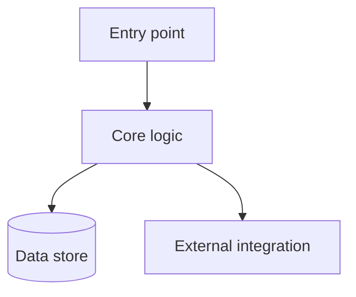

# ARCHITECTURE.md — [System name]

> The 10,000-foot structure: components, boundaries, and the main data flow — the stable shape the agent reads before touching a feature.
> Keep it **structural and short**. The *why* behind hard choices lives in ADRs (`docs/adr/`); how to operate the system lives in the runbook. Add this file when the structure has earned a written form, and update it only when a boundary or component actually changes.

## Components

[Optional diagram — renders on GitHub/GitLab. Delete it if a plain list is clearer.]

## Components, one line each

- **[Component]** — [what it does, in one line. Note if it's pure / holds no I/O.]
- **[Component]** — [...]

## Boundaries

- [What each layer may and may not do — e.g. "I/O lives in repositories; handlers transform data only."]
- [Cross-cutting concerns and where they live — logging, validation, auth.]

## Data flow — [the main path]

1. [What triggers it → what happens next.]
2. [...]
3. [The failure path — retry, dead-letter, or surface to the caller. Cite the ADR if a decision governs it.]

---
See `docs/adr/` for the decisions that shaped this structure; the in-force set is indexed in `CLAUDE.md` § Active decisions.
